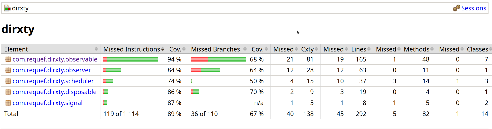

# diRXty
Простая реактивная библиотека, вдохновленная RxJava.  
Написана на Java 21.

## Quick start

Запуск демо-программы (расположена в `demo/src/main/java/com/requef/demo/Main.java`):
```bash
./gradlew :demo:run
```

Сборка библиотеки (расположена в `dirxty/src/main/java/com/requef/dirxty`):
```bash
./gradlew :dirxty:build
```

Запуск юнит-тестов на ключевые компоненты библиотеки (расположены в `dirxty/src/test/java/com/requef/dirxty`):
```bash
./gradlew :dirxty:test
```

## Обзор
### Архитектура
Проект разделен на два gradle sub-проекта - `demo` (демонстрационная программа) и `dirxty` (сама библиотека).  
В целом, библиотека построена на концептах Observable и Observer. Observable - это способ подписывания Observer'а на какой-то источник данных.  
Операторы map/filter/flatMap а также методы subscribeOn/observeOn просто оборачивают Observable в еще один Observable.

Observable ленивые, как и в RxJava. Источник данных начинает работу только тогда, когда на него подписывается Observer.  
Сам по себе Observable это простой интерфейс:
```java
public interface Observer<T> {
    void onNext(T item);
    void onError(Throwable t);
    void onComplete();
}
```
Однако, тут прослеживается некоторый "контракт" - `onError` и `onComplete` должны вызываться не более одного раза, а после их вызова `onNext` должен больше не вызываться - поток считается завершенным.  
Пользователи библиотеки могут пытаться нарушить данный контракт, например, через следующий код:
```java
var o = Observable.create(emitter -> {
    emitter.onNext(1);
    emitter.onComplete();
    emitter.onNext(2); // поток уже завершен, игнорируем значение
});
```
или
```java
var o = Observable.create(emitter -> {
    emitter.onNext(1);
    emitter.onError(error1);
    emitter.onError(error2); // ошибка уже создана, игнорируем вторую ошибку
});
```
Чтобы поддерживать выполнения этого контракта в библиотеке используются классы `SafeObserver` и `CreateEmitter`.

Как уже говорилось ранее, map/filter - это еще одни Observable, которые оборачивают предыдущий Observer.  
Так как эти операторы просто трансформируют данные (не обрабатывают ошибки, завершение потока), их несложно реализовать:
```java
return new Observable<>(observer -> Observable.this.subscribe(new Observer<>() {
    @Override
    public void onNext(T item) {
        var mapped = mapper.apply(item); // map
        observer.onNext(mapped);
    }

    @Override
    public void onError(Throwable t) {
        observer.onError(t); // ошибки передаются upstream как есть
    }

    @Override
    public void onComplete() {
        observer.onComplete(); // завершение передается upstream как есть
    }
}));
```
Аналогично реализуется filter.  
flatMap реализуется сложнее, так как преобразует Observable одного типа в Observable другого типа и создает новый Observable для каждого элемента данных.  
Концептуально, это выглядит так: upstream дает какие-то данные, для каждого элемента данных создается новый "внутренний" Observable, наконец все внутренни Observable отправляют данные downstream, а события этих Observable объединяются.

Ошибка в Observable - терминальное событие. При получении ошибки Observable все остальные события игнорируются, а оставшиеся подписки отменяются. Сами Observable переводятся в "выключенное" состояние (terminated).

Каждая подписка возвращает экземпляр Disposable:
```java
public interface Disposable {
    void dispose();
    boolean isDisposed();
}
```
Это нужно чтобы пользователь мог отписаться от потока - соответственно, поток перестал производить данные:
```java
var d = observable.suscribe(observer);
// ...
d.dispose(); // поток прекращает работу.
```
Источники данных сами проверяют "не избавились ли еще от потока" через метод isDisposed(), чтобы остановить работу 
(такой прием, в целом, называют *cooperative cancellation*).  
Само закрытие потока через dispose(), очевидно, происходит каскадно - сигнал о завершении передается upstream для каждого Observable в потоке.

Для управления "контекстом" исполнения источника данных используется метод subscribeOn:
```java
var o = Observable.create(emitter -> {
    // код, который будет выполняться в IO потоке.
}).subscribeOn(Schedulers.io());
```
Источник выполняется в конкретном потоке, который определяет subscribeOn. Реализовано это примерно так:
```java
scheduler.execute(() -> {
    Disposable upstream = previous.subscribe(observer);
});
```

Аналогичный оператор observeOn позволяет переключить контекст, в котором выполняются downstream операции:
```java
var o = Observable.create(emitter -> {
    // код, который будет выполняться в IO потоке.
}).subscribeOn(Schedulers.io())
  .observeOn(Schedulers.computation())
  .subscribe(observer); // observer будет выполняться в computation потоке.
```
Для того, чтобы observeOn умел передавать события downstream Observer'ам, которые выполняются в другом потоке, используется очередь "сигналов".  
Сигналы "зеркалируют" методы Observer'а - onNext/onError/onComplete и передают определенную информацию:
```java
public enum SignalType {
    NEXT(item),
    ERROR(error),
    COMPLETE
}
```
Например, когда upstream вызывает onNext, observeOn помещает сигнал NEXT в очередь и запускает опустошение очереди.  
observeOn, в принципе, мог бы просто сразу же запускать обработку каждого сигнала через scheduler.execute(), в обход всяких очередей, 
однако тут возникают две основные проблемы:
1. События могут выполняться в любом порядке - порядок выполнения идет на откуп scheduler'у.
2. Между событиями observeOn и onComplete самого Observable может произойти гонка.  
   Например, несколько событий могут встать в очередь executor'а, а в этот момент Observable может начать завершаться.  
   В целом, предотвращать события после завершения Observable становится намного сложнее.

В стандартной библиотеке Java есть определенные реактивные концепты из модуля Flow: Publisher, Subscriber, Subscription.  
Тем не менее, Flow не используется в реализации библиотеки, так как:
1. по заданию мы должны иметь свой интерфейс Observable
2. по заданию мы должны иметь свой интерфейс Disposable
3. Flow предоставляет множество других концептов (backpressure, request, и так далее), которые совершенно не нужны в этом проекте.  
   Например, механизм backpressure совершенно не реализуется в данной библиотеке. Он бы кардинально усложнил архитектуру и реализацию библиотеки.

### Schedulers
Работа scheduler'ов применительно к этой библиотеке описана в предыдущем разделе.  
Однако, еще раз отметим, что scheduler'ы применяются при определении контекста выполнения источника данных и разных downstream операций при помощи методов subscribeOn и observeOn.  
Например, для выполнения источника данных в IO потоке, а downstream операций в computation потоке, можно написать:
```java
var o = Observable.create(emitter -> {
    // ...
    // код, который будет выполняться в IO потоке.
}).subscribeOn(Schedulers.io())
  .observeOn(Schedulers.computation())
  .map( /* ... */ ) // map будет выполняться в computation потоке.
  .subscribe(observer); // observer будет выполняться в computation потоке.
```

Для реализации scheduler'ов используется стандартные Executors из Java. Сами scheduler'ы зеркалируют поведение из RxJava:
1. Schedulers.io() -> Executors.newCachedThreadPool() - кэшированные потоки. 
2. Schedulers.computation() -> Executors.newFixedThreadPool() - фиксированное количество потоков, равное количеству процессоров.
3. Schedulers.single() -> Executors.newSingleThreadExecutor() - один поток для всех задач.

Разработчик сам выставляет конкретный тип scheduler'а для конкретного Observable, в зависимости от того, какой тип лучше применим.  
Schedulers.io() используется для IO-задач, где может быть много блокировок/ожиданий, например: сетевые запросы, операции с файлами, программы, которы специально простаивают (например, демо-программа) и так далее.
Schedulers.computation() используется для CPU-задач, где требуется интенсивная обработка данных, например: CPU вычисления (математика), парсинг данных и так далее.  
Schedulers.single() используется для задач, которые должны выполняться последовательно в одном потоке, например: какой-то строгий event loop произвольного приложения, где каждый обработчик зависит от результатов предыдущего, и так далее.

### Тестирование
Юнит-тесты для библиотеки находятся в папке `dirxty/src/test/java/com/requef/dirxty`.  
Тестируется:
- весь основной функционал (Observer, подписка, Disposable, ...); 
- обработка и передача ошибок;
- работа Schedulers (в том числе в многопоточной среде); 
- работа операторов map/filter/flatMap.

Для библиотеки собирается покрытие юнит-тестами с помощью `jacoco`:
```bash
./gradlew :dirxty:jacocoTestReport
```
HTML-отчет с покрытием будет доступен в `dirxty/build/reports/jacoco/html`.  
С коммита `d0407802` было сгенерировано покрытие кода библиотеки юнит-тестами, его общие результаты:  
  
Покрытие достаточно хорошее, в целом покрываются 89% инструкций и 67% всех ветвлений.

Также базовая работа библиотеки проверена в демо-программе.

### Примеры использования библиотеки
Пару примеров использования находится в демо-программе: `demo/src/main/java/com/requef/demo/Main.java`.  
Обычный пример:
```java
try (var io = Schedulers.io();
     var computation = Schedulers.computation();
     var single = Schedulers.single()
) {
    var subscription = Observable.<Integer>create(emitter -> {
        log.info("source subscribed");
        for (int i = 1; i <= 5 && !emitter.isDisposed(); i++) {
            log.info("emit {}", i);
            emitter.onNext(i);
            Thread.sleep(100);
        }
        emitter.onComplete();
    }).subscribeOn(io)
    .filter(i -> {
        log.info("filter {}", i);
        return i % 2 == 1;
    }).map(i -> {
        log.info("map {}", i);
        return i * 10;
    }).flatMap(i -> Observable.<String>create(inner -> {
        log.info("inner source for {}", i);
        inner.onNext("value=" + i);
        inner.onNext("value=" + i + ", square=" + (i * i));
        inner.onComplete();
    }).subscribeOn(computation))
    .observeOn(single)
    .subscribe(new Observer<>() {
        @Override
        public void onNext(String item) {
            log.info("observer received: {}", item);
        }
        @Override
        public void onError(Throwable t) {
            log.info("observer error", t);
        }
        @Override
        public void onComplete() {
            log.info("observer complete");
        }
    });
    // ...
    subscription.dispose();
}
```
Пример с обработкой ошибки:
```java
Observable.<Integer>create(emitter -> {
    emitter.onNext(1);
    emitter.onNext(2);
    emitter.onNext(3);
    emitter.onComplete();
}).map(i -> {
    if (i == 2) {
        throw new IllegalStateException("exception at " + i);
    }
    return i;
}).observeOn(single)
.subscribe(new Observer<>() {
    @Override
    public void onNext(Integer item) {
        log.info("error-demo item: {}", item);
    }
    @Override
    public void onError(Throwable t) {
        log.info("error-demo handled: {}", t.getMessage());
    }
    @Override
    public void onComplete() {
        log.info("error-demo complete");
    }
});
```
Пример с CPU-интенсивной задачей (вычисление последовательности Фибоначчи):
```java
Observable.<Integer>create(emitter -> {
    for (int i = 42; i <= 69; i++) {
        emitter.onNext(i);
    }
    emitter.onComplete();
})
.flatMap(n -> Observable.<String>create(inner -> {
    var result = fibonacci(n); // fibonacci(n) - CPU-интенсивная задача
    inner.onNext("fib(" + n + ") = " + result);
    inner.onComplete();
}).subscribeOn(computation))
.observeOn(single)
.subscribe(new Observer<>() {
    @Override
    public void onNext(String item) {
        System.out.println("calculation result: " + item);
    }
    @Override
    public void onError(Throwable t) {
        System.out.println("error: " + t.getMessage());
    }
    @Override
    public void onComplete() {
        System.out.println("complete");
    }
});
```
Произвольный пример с flatMap. Пытаемся загрузить пользователя из БД (IO-интенсивная задача), посчитать какую-то метрику для пользователя (CPU-интенсивная задача) и обработать результат одним потоком:
```java
Observable.<Integer>create(emitter -> {
    emitter.onNext(101);
    emitter.onNext(102);
    emitter.onNext(103);
    emitter.onComplete();
})
.flatMap(userId -> Observable.<String>create(inner -> {
    var user = getUserFromDB(userId); // обращение к БД - IO.
    inner.onNext(user);
    inner.onComplete();
}).subscribeOn(io))
.flatMap(user -> Observable.<String>create(inner -> {
    int score = calculateDummyScore(user); // просчет метрики - CPU.
    inner.onNext(user + ", score=" + score);
    inner.onComplete();
}).subscribeOn(computation))
.observeOn(single) // наблюдаем за результатом в одном потоке.
.subscribe(new Observer<>() {
    @Override
    public void onNext(String item) {
        System.out.println("final result: " + item);
    }
    @Override
    public void onError(Throwable t) {
        System.out.println("error: " + t.getMessage());
    }
    @Override
    public void onComplete() {
        System.out.println("complete");
    }
});
```

## Источники
- [RXJava Repository](https://github.com/ReactiveX/RxJava) (многие термины/концепты взяты оттуда)
